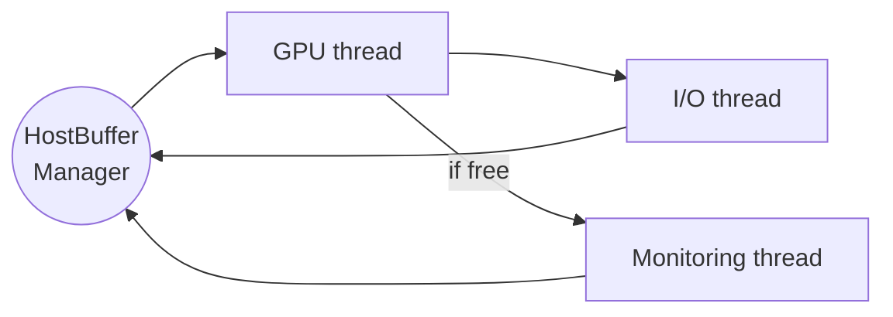

Adding monitoring histograms
============================

Overview
--------

Monitoring in Allen is performed by dedicated monitoring threads (by default there is a single thread). 
After a slice of data is processed, the `HostBuffers` corresponding to that slice are sent to the monitoring 
thread concurrent with being sent to the I/O thread for output. The flow of `HostBuffers` is shown below:



To avoid excessive load on the CPU, monitoring threads will not queue `HostBuffers`, i.e, if the 
monitoring thread is already busy then new `HostBuffers` will be immediately marked as monitored. 
Functionality exists within `MonitorManager` to reactively reduce the amount of monitoring performed 
(n.b. this corresponds to an **increase** in the `monitoring_level`) in response to a large number of skipped 
slices. This is not currently used but would allow monitoring to favour running *some* types of monitors 
for *all* slices over running *all* types of monitors for *some* slices. Additionally, less important monitors 
could be run on a random sub-sample of slices. The `MetaMonitor` provides monitoring histograms that track 
the numbers of successfully monitored and skipped slices as well as the monitoring level. 

Monitor classes
---------------

Currently, monitoring is performed of the rate for each HLT line (`RateMonitor`) and for the momentum,
pT and chi^2(IP) of each track produced by the Kalman filter (`TrackMonitor`). Further monitoring histograms
can be either added to one of these classes or to a new monitoring class, as appropriate.

Additional monitors that produce histograms based on information in the `HostBuffers` should be added to 
`integration/monitoring` and inherit from the `BufferMonitor` class. The `RateMonitor` class provides an 
example of this. Furthermore, each histogram that is added must be given a unique key in MonitorBase::MonHistType. 

Once a new monitoring class has been written, this may be added to the monitoring thread(s) by including an instance 
of the class in the vectors created in `MonitorManager::init`, e.g.
```
m_monitors.back().push_back(new RateMonitor(buffers_manager, time_step, offset));
```

To monitor a feature, either that feature or others from which it can be calculated must be present in the
`HostBuffers`. For example, the features recorded by `TrackMonitor` depend on the buffers `host_kf_tracks`
(for the track objects) and `host_atomics_scifi` (for the number of tracks in each event and the offset to the
start of each event). It is important that any buffers used by the monitoring are copied from the device to
the host memory and that they do not depend on `runtime_options.do_check` being set. Additionally, to avoid
a loss of performance, these buffers must be written to pinned memory, i.e. the memory must be allocated by
`cudaMallocHost` and not by `malloc` in `HostBuffers::reserve`.

Saving histograms
-----------------

All histograms may be saved by calling `MonitorManager::saveHistograms`. This is currently performed once after 
Allen has finished executing. In principle, this could be performed on a regular basis within the main loop but 
ideally would require monitoring threads to be paused for thread safety. 

Histograms are currently written to `monitoringHists.root`.
 